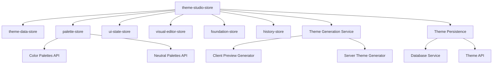
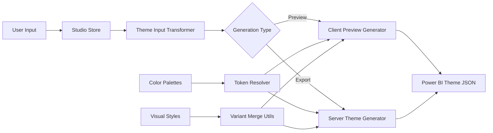

# PowerUI Architecture & Data Flow Analysis

## Table of Contents

1. [System Overview](#system-overview)
2. [Component Architecture](#component-architecture)
3. [Data Flow Patterns](#data-flow-patterns)
4. [State Management](#state-management)
5. [Database Schema & Persistence](#database-schema--persistence)
6. [Theme Generation Pipeline](#theme-generation-pipeline)
7. [Areas for Improvement](#areas-for-improvement)
8. [Performance Analysis](#performance-analysis)
9. [Recommendations](#recommendations)

## System Overview

PowerUI is a sophisticated Power BI theme generator built with Next.js, featuring:

- **Frontend**: React with TypeScript, Zustand for state management
- **Backend**: Next.js API routes with Prisma ORM
- **Database**: PostgreSQL with complex relational schema
- **Authentication**: Clerk for user management
- **Payments**: Stripe integration for subscriptions

### Key Features
- Real-time theme customization with live preview
- Advanced color palette generation and management
- Visual-specific styling with variant support
- Team collaboration and sharing
- Power BI schema compliance and validation

## Component Architecture

### Hierarchical Structure

```
App Layout
├── Authentication Layer (Clerk)
├── Theme Studio
│   ├── Foundation Controls
│   │   ├── Color Palette Manager
│   │   ├── Typography Controls
│   │   └── Structural Colors
│   ├── Visual Customizer
│   │   ├── Visual Properties Panel
│   │   ├── Schema Form Renderer
│   │   └── Property Input Controls
│   ├── Preview System
│   │   ├── Power BI Embed
│   │   └── Live Theme Preview
│   └── Persistence Layer
│       ├── Save/Load Actions
│       └── Change Tracking
├── Palette Management
│   ├── Color Palette Editor
│   ├── Neutral Palette Generator
│   └── Palette Store
└── Theme Gallery
    ├── Theme Cards
    ├── Sharing Controls
    └── Organization Management
```

### Store Architecture



## Data Flow Patterns

### 1. Theme Initialization Flow

```typescript
// Flow: App Start → Load Theme → Resolve Palettes → Generate Preview
1. useThemeStudio() hook initializes
2. theme-studio-store creates default theme
3. Palette resolution triggered via useThemeStudioPalettes()
4. Color/neutral palettes fetched from API/database
5. Client preview generator creates real-time preview
6. UI components subscribe to specific store slices
```

**Data Path:**
```
Database → API → Stores → Hooks → Components → UI
```

### 2. User Interaction Flow

```typescript
// Flow: User Input → Store Update → Change Tracking → Preview Update
1. User interacts with UI component (e.g., color picker)
2. Component calls hook method (e.g., setColorPaletteId)
3. Hook updates theme-studio-store
4. Store triggers change tracking in theme-changes-store
5. Palette resolution hook detects change
6. Preview generator rebuilds theme preview
7. UI components re-render with new data
```

### 3. Theme Save Flow

```typescript
// Flow: Save Action → Validation → Database → State Update
1. User triggers save action
2. useThemePersistence() hook collects theme data
3. Theme data validated and cleaned
4. API call to /api/themes (POST/PUT)
5. Database persistence via ThemeService
6. Change tracking cleared
7. UI updated with saved state
```

### 4. Palette Management Flow

```typescript
// Flow: Palette Change → Resolution → Token Update → Preview Refresh
1. User selects different color palette
2. theme-studio-store updates colorPaletteId
3. useThemeStudioPalettes() detects change
4. Palette resolution service fetches new palette
5. Token resolver updates with new palette
6. Client preview generator rebuilds theme
7. Visual previews update across UI
```

## State Management

### Store Responsibilities

#### 1. theme-studio-store (Primary Store)
**Purpose**: Central theme data and UI state management
**Size**: ~700 lines - **🚨 TOO LARGE**

**Responsibilities:**
- Theme metadata and foundation settings
- Visual styles management
- UI state (selected visual, variant, section)
- Change tracking integration
- Palette resolution coordination

**Issues:**
- **Monolithic**: Too many responsibilities in one store
- **Complex state updates**: Deep object mutations
- **Performance**: Frequent re-renders due to large state object

#### 2. theme-data-store (Secondary Store)
**Purpose**: Legacy theme data management
**Status**: **🚨 REDUNDANT** - Overlaps with theme-studio-store

**Issues:**
- Duplicate data structures
- Inconsistent API with main store
- Confusing separation of concerns

#### 3. palette-store
**Purpose**: Color and neutral palette management
**Issues:**
- **API coupling**: Direct API calls in store actions
- **Error handling**: Inconsistent error states
- **Cache management**: No intelligent caching strategy

### Hook Layer Architecture

```typescript
// Hook composition pattern
useThemeStudio()
├── useThemeData() ───────► theme-studio-store (theme data)
├── useThemeUI() ─────────► theme-studio-store (UI state)
├── useThemePersistence()─► theme-studio-store (save/load)
├── useThemePreviewGenerator() ──► Client preview logic
├── useThemeStudioPalettes() ────► Palette resolution
└── useThemeChanges() ────────────► Change tracking
```

**Benefits:**
- ✅ Granular subscriptions reduce re-renders
- ✅ Separation of concerns
- ✅ Reusable logic

**Issues:**
- 🚨 Complex interdependencies
- 🚨 Difficult to debug data flow
- 🚨 Hook composition overhead

## Database Schema & Persistence

### Schema Analysis

```sql
-- Core theme storage
Theme {
  id: uuid (primary key)
  userId: string (foreign key)
  name: string
  description: string?
  themeData: JSON ← **PROBLEM: Unstructured data**
  version: string
  visibility: enum
  organizationId: string? (foreign key)
}

-- Color palette storage
ColorPalette {
  id: uuid
  userId: string (foreign key)
  name: string
  colors: JSON ← **Array of hex colors**
  isBuiltIn: boolean
}

-- Neutral palette storage  
NeutralPalette {
  id: uuid
  userId: string? (foreign key)
  name: string
  colors: JSON ← **12-color shade array**
  isBuiltIn: boolean
}
```

### Data Structure Issues

#### 1. Unstructured Theme Data
```typescript
// Current: Unstructured JSON blob
themeData: {
  colorPaletteId: string,
  visualStyles: any, // ← Unvalidated structure
  structuralColors: any,
  // ... mixed structure
}
```

**Problems:**
- No schema validation
- Difficult to query/index
- Migration challenges
- Data integrity issues

#### 2. Color Palette Inconsistencies
```typescript
// Multiple formats supported:
colors: string[] | Record<string, string> | { shade: string }[]
```

**Problems:**
- Format conversion overhead
- Type safety issues
- Complex resolution logic

### Persistence Patterns

#### Save Flow Analysis
```typescript
// Current save flow - 5 steps with multiple failure points
1. Collect data from multiple stores
2. Transform data format for API
3. Validate theme structure
4. Database transaction
5. Update local state

// Issues:
- No optimistic updates
- No conflict resolution
- Limited error recovery
- No auto-save capability
```

## Theme Generation Pipeline

### Architecture Overview



### Generation Process Analysis

#### 1. Client-Side Preview Generation
**Purpose**: Real-time theme previews without API calls
**Performance**: ✅ Fast, ❌ Limited accuracy

```typescript
class ClientPreviewGenerator {
  generatePreview(input: ThemeGenerationInput): PowerBITheme {
    // 1. Create base theme structure
    // 2. Resolve color tokens
    // 3. Apply visual styles
    // 4. Apply Power BI quirks
    // 5. Clean up empty objects
  }
}
```

**Issues:**
- **Limited validation**: No server-side schema validation
- **Quirk management**: Power BI-specific fixes scattered throughout
- **Token resolution**: Complex recursive replacement logic

#### 2. Server-Side Generation
**Purpose**: Production theme export with full validation
**Performance**: ❌ Slower, ✅ Complete accuracy

**Issues:**
- **Duplication**: Similar logic to client-side generator
- **API overhead**: Network calls for simple operations
- **Caching**: No intelligent caching strategy

### Color Token System

#### Token Resolution Flow
```typescript
// Multi-stage token resolution
1. Palette Resolution: colorPaletteId → ColorPalette object
2. Token Creation: Palette → Token mappings ({neutral.100}, {brand.500})
3. Token Replacement: Replace tokens in theme structure
4. Validation: Ensure valid color values
```

**Problems:**
- **Performance**: Recursive object traversal on every change
- **Complexity**: Deep nested token replacement logic
- **Error handling**: Poor error messages for invalid tokens

## Areas for Improvement

### 1. State Management Issues

#### Store Fragmentation
**Problem**: 7 different stores with overlapping responsibilities
```typescript
// Current state management
theme-studio-store (694 lines) ← Too large, too many responsibilities
theme-data-store (162 lines)  ← Redundant with studio store
palette-store (296 lines)     ← Good, but API-coupled
ui-state-store (69 lines)     ← Could be merged
visual-editor-store (114 lines) ← Could be merged
foundation-store (117 lines)   ← Could be merged  
history-store (88 lines)      ← Good separation
```

**Impact**: 
- Complex debugging
- Performance overhead
- Inconsistent data flow
- Difficult testing

#### Recommended Structure:
```typescript
// Simplified store architecture
core-theme-store (theme data + UI state)
palette-cache-store (palette resolution + caching)
change-tracking-store (change history + dirty state)
```

### 2. Performance Issues

#### Re-render Analysis
```typescript
// Current: Frequent re-renders due to large state objects
const theme = useThemeStudioStore(state => state.theme); // ← Subscribes to entire theme
const colorPalette = useThemeStudioStore(state => state.resolved.colorPalette);

// Problem: Any theme change triggers all subscribers
```

**Issues:**
- Deep object equality checks
- Large object subscriptions
- Unnecessary component re-renders
- Preview regeneration on every change

#### Memory Usage
```typescript
// Multiple copies of theme data
1. theme-studio-store.theme (source of truth)
2. theme-data-store.currentTheme (duplicate)
3. resolved.previewTheme (generated copy)
4. Component local state (form data)
5. Change tracking (diff copies)
```

### 3. API Efficiency Issues

#### N+1 Query Problem
```typescript
// Current palette resolution
1. Fetch theme → GET /api/themes/[id]
2. Extract colorPaletteId from theme data
3. Fetch color palette → GET /api/palettes/color/[id] 
4. Extract neutralPaletteId from theme data  
5. Fetch neutral palette → GET /api/palettes/neutral/[id]

// Should be: Single call with joins
GET /api/themes/[id]?include=colorPalette,neutralPalette
```

#### Redundant API Calls
```typescript
// Problem: Same palette fetched multiple times
useThemeStudioPalettes() → Fetches palettes
ModernPaletteEditor → Fetches same palettes
UnifiedPaletteManager → Fetches same palettes again
```

### 4. Data Structure Issues

#### Untyped Theme Data
```typescript
// Current: Loosely typed
interface Theme {
  themeData: any; // ← No type safety
}

// Should be: Strongly typed
interface Theme {
  themeData: ThemeGenerationInput; // ← Type-safe structure
}
```

#### Mixed Data Formats
```typescript
// Color palette formats
string[] | Record<string, string> | { shade: string }[]
// Should standardize on single format
```

### 5. Schema Form Complexity

#### Recursive Rendering Issues
```typescript
// schema-form.tsx: 626 lines of complex recursive logic
export function SchemaForm({ schema, value, onChange, ... }) {
  // Handle $ref resolution
  // Handle allOf merging  
  // Handle oneOf selection
  // Handle anyOf selection
  // Recursive component rendering
}
```

**Problems:**
- **Performance**: Deep recursion on large schemas
- **Memory**: Stack overflow risk with circular refs
- **Debugging**: Difficult to trace rendering issues
- **Maintainability**: Complex conditional logic

## Performance Analysis

### Critical Performance Issues

#### 1. Store Update Frequency
```typescript
// Measurement: Theme studio generates ~50-100 store updates per user interaction
updateTheme() calls → ~20-30 per second during active editing
Palette resolution → ~5-10 per palette change
Preview generation → ~100ms per update
```

#### 2. Component Re-render Analysis
```typescript
// High-frequency re-renders identified:
SchemaForm components: ~30-50 re-renders per theme change
Visual preview components: ~10-20 re-renders per update
Palette display components: ~5-10 re-renders per palette change
```

#### 3. Memory Usage
```typescript
// Memory analysis:
Theme data size: ~50-200KB per theme
Preview theme size: ~100-500KB per generated theme  
Store total size: ~1-5MB with multiple themes loaded
Component tree size: ~500-1000 components in studio
```

### Performance Recommendations

#### 1. Optimize Store Subscriptions
```typescript
// Current: Subscribe to entire objects
const theme = useThemeStudioStore(state => state.theme);

// Better: Subscribe to specific properties
const themeName = useThemeStudioStore(state => state.theme.name);
const themeMode = useThemeStudioStore(state => state.theme.mode);
```

#### 2. Implement Smart Memoization
```typescript
// Add React.memo with custom comparison
const ThemePreview = React.memo(({ theme }) => {
  // Heavy preview rendering
}, (prevProps, nextProps) => {
  // Custom comparison logic
  return isEqual(prevProps.theme, nextProps.theme);
});
```

#### 3. Debounce Updates
```typescript
// Debounce frequent updates
const debouncedUpdateTheme = useMemo(
  () => debounce(updateTheme, 100),
  [updateTheme]
);
```

## Recommendations

### 1. Store Architecture Refactor

#### Phase 1: Consolidate Stores
```typescript
// New simplified architecture
interface CoreThemeStore {
  // Theme data
  theme: ThemeGenerationInput;
  
  // UI state  
  ui: {
    selectedVisual: string;
    selectedVariant: string;
    // ... other UI state
  };
  
  // Actions
  updateTheme: (updates: Partial<ThemeGenerationInput>) => void;
  setUIState: (updates: Partial<UIState>) => void;
}
```

#### Phase 2: Extract Services
```typescript
// Service layer for complex operations
class ThemePreviewService {
  static generatePreview(theme: ThemeGenerationInput): PowerBITheme;
}

class PaletteService {
  static async resolvePalettes(theme: ThemeGenerationInput): Promise<ResolvedPalettes>;
}
```

### 2. Database Schema Improvements

#### Structured Theme Data
```sql
-- Add structured columns
ALTER TABLE themes 
ADD COLUMN color_palette_id UUID REFERENCES color_palettes(id),
ADD COLUMN neutral_palette_id UUID REFERENCES neutral_palettes(id),
ADD COLUMN theme_mode VARCHAR(10) CHECK (theme_mode IN ('light', 'dark')),
ADD COLUMN font_family VARCHAR(255);

-- Move visual_styles to separate table for indexing
CREATE TABLE theme_visual_styles (
  id UUID PRIMARY KEY,
  theme_id UUID REFERENCES themes(id),
  visual_type VARCHAR(100),
  variant VARCHAR(100),
  styles JSONB
);
```

#### Add Proper Indexes
```sql
-- Performance indexes
CREATE INDEX idx_themes_user_updated ON themes(user_id, updated_at DESC);
CREATE INDEX idx_color_palettes_user_name ON color_palettes(user_id, name);
CREATE INDEX idx_visual_styles_theme_type ON theme_visual_styles(theme_id, visual_type);
```

### 3. API Optimization

#### Batch Operations
```typescript
// Single endpoint for theme with palettes
GET /api/themes/[id]/complete
{
  theme: Theme,
  colorPalette: ColorPalette,
  neutralPalette: NeutralPalette,
  organizationInfo?: Organization
}
```

#### Intelligent Caching
```typescript
// Cache strategy
1. Browser cache: 5 minutes for palettes
2. SWR/React Query: Background refetch
3. Server cache: Redis for palette resolution
4. CDN cache: Static built-in palettes
```

### 4. Component Architecture

#### Reduce Schema Form Complexity
```typescript
// Extract specialized form components
<ColorPaletteField />
<TypographySection />
<VisualStyleEditor />
<StructuralColorEditor />

// Instead of recursive SchemaForm
```

#### Optimize Preview System
```typescript
// Virtual preview rendering
const VirtualPreviewGrid = () => {
  // Only render visible previews
  // Lazy load off-screen previews
  // Recycle preview components
};
```

### 5. Performance Optimization

#### Implement Change Batching
```typescript
// Batch multiple changes
const batchedUpdates = useBatchedUpdates();

batchedUpdates(() => {
  updateTheme({ colorPaletteId: 'new-palette' });
  updateTheme({ mode: 'dark' });
  updateTheme({ fontFamily: 'Arial' });
}); // Single re-render
```

#### Add Loading States
```typescript
// Better UX during operations
const { data, isLoading, error } = useThemePreview(theme);

if (isLoading) return <ThemePreviewSkeleton />;
if (error) return <ErrorBoundary error={error} />;
return <ThemePreview data={data} />;
```

### 6. Developer Experience

#### Add Debugging Tools
```typescript
// Debug store state
if (process.env.NODE_ENV === 'development') {
  window.__THEME_STUDIO_DEBUG__ = {
    stores: getAllStoreStates(),
    performance: getPerformanceMetrics(),
    dataFlow: getDataFlowTrace()
  };
}
```

#### Improve Error Handling
```typescript
// Comprehensive error boundaries
<ErrorBoundary
  fallback={<ThemeStudioErrorFallback />}
  onError={(error, errorInfo) => {
    logError('ThemeStudio', error, errorInfo);
  }}
>
  <ThemeStudio />
</ErrorBoundary>
```

This analysis reveals that while PowerUI has a sophisticated architecture, there are significant opportunities for improvement in performance, maintainability, and developer experience. The recommendations above should be prioritized based on user impact and development resources.